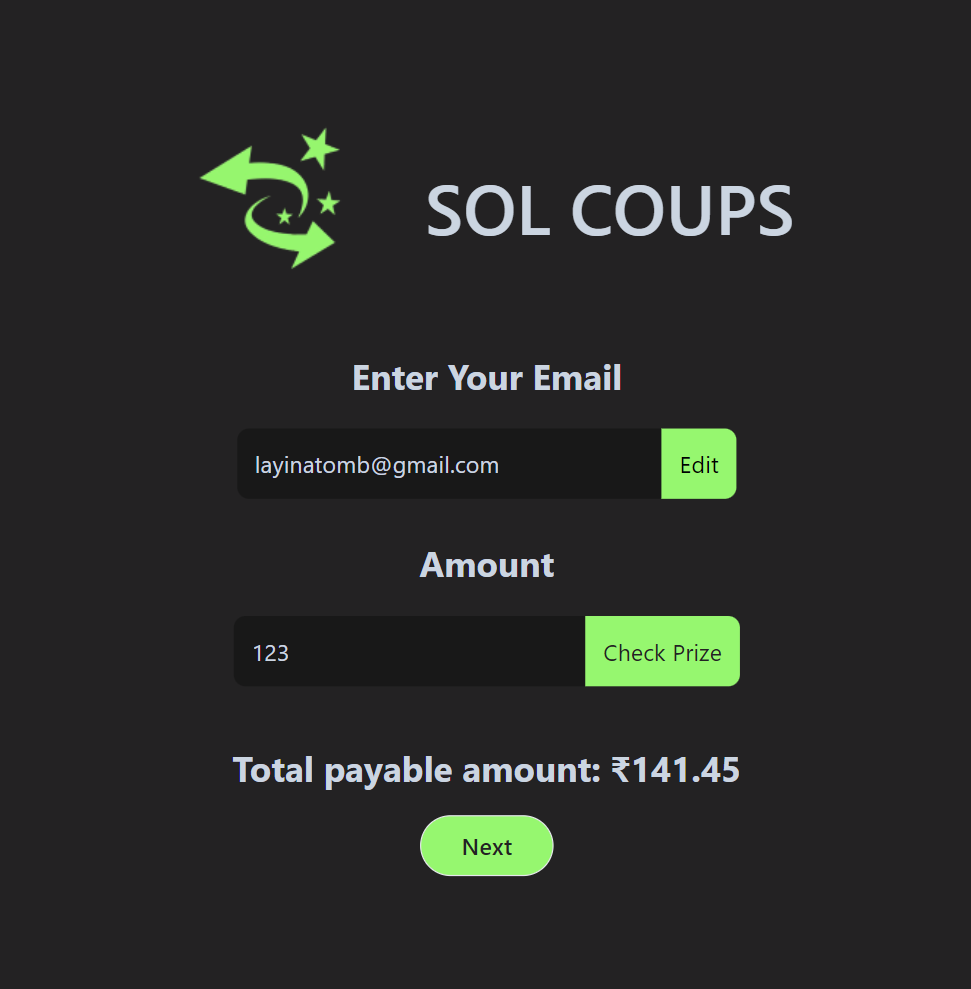
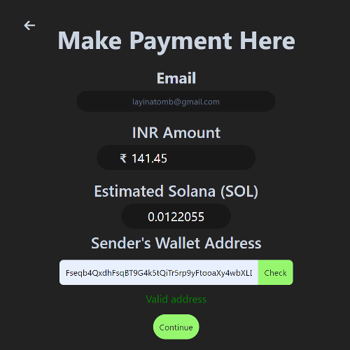
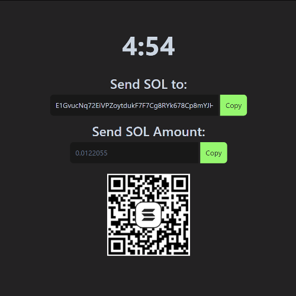

# SOL Coups

SOL Coups is a user-friendly application designed to help users buy gift vouchers in exchange for their SOL coins. This project leverages the Solana blockchain to provide a quick and secure way for users to swap their cryptocurrency for gift cards. 

## Running the Application

To view the application correctly, **please make sure to open only the `index.html` file** in your browser. Opening other files directly may result in incomplete or incorrect rendering of the application.

### How to Run

1. Navigate to the `index.html` file in your file system.
2. Open `index.html` file in your browser.
3. Ensure that all other files in the project are in their original locations relative to `index.html`.

Following these steps will ensure that the application functions as intended. If you encounter any issues, please make sure you are running `index.html` and not any other files directly. The page should look something like this:


On providing your email address and amount you want on your gift voucher, sol coups will give you an approximate value of inr you will need to send via crypto to get the voucher you want. The application then takes you to the next page where payment details are finalized:


Once a correct sender's wallet address is provided, user is taken to the payment gateway where awindow of 5 min opens for user to make payment:


## Features

- **Multi-Page Navigation:** Smooth transitions between different pages within the application.
- **Email Validation:** Ensures that users input a valid email address before proceeding with transactions.
- **Cryptocurrency Payment:** Handles payments using COL coins, converting them to gift vouchers.
- **Wallet Address Validation:** Checks the validity of the user's Solana wallet address before processing transactions.

## Getting Started

Follow these instructions to set up and run the SOL Coups application on your local machine.

### Prerequisites

- [Node.js](https://nodejs.org/)
- [Solana CLI](https://docs.solana.com/cli/install-solana-cli-tools)
- [COL Wallet](#)

### Installation

1. Clone the repository:

   ```bash
   git clone https://github.com/yourusername/sol-coups.git
