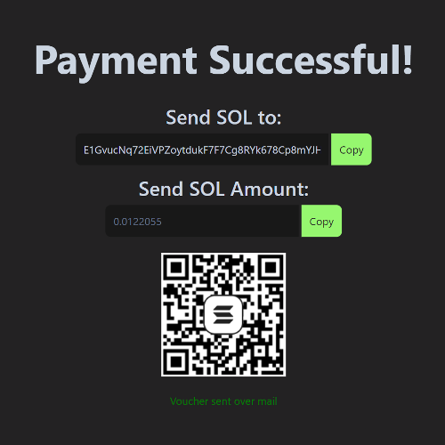
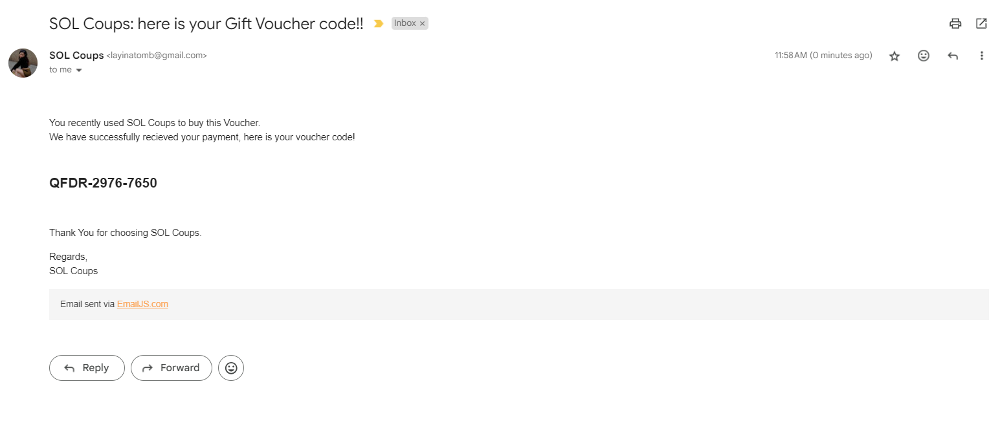

# SOL COUPS

SOL Coups is a user-friendly application designed to help users buy gift vouchers in exchange for their SOL coins. This project leverages the Solana blockchain to provide a quick and secure way for users to swap their cryptocurrency for gift cards.

## Getting Started

To view the application correctly, please make sure to **open only the `index.html` file** in your browser. Opening other files directly may cause incomplete or incorrect rendering of the application.

### Prerequisites

1. The latest version of any js supporting webbrowser, eg- [Google Chrome](https://www.google.com/chrome/what-you-make-of-it/).
2. A directory to store all our files seperately :)

### Installing

Download the files and save them to a directory on your local machine. Once downloaded, extract the files, and you're all set!

## How to Run

1. Navigate to the `index.html` file in your file system.
2. Ensure that all other files in the project are in their original locations relative to `index.html`.
3. Open `index.html` file in your browser. 

### An Example Run

Following these steps will ensure that the application functions as intended.
If you encounter any issues, please make sure you are running `index.html` and not any other files directly. 
 
The page should look something like this-

<dl><dd><dl><dd><dl><dd>
  

    
  

</dd></dl></dd></dl></dd></dl>
 

By providing your email address and the desired amount for the gift voucher, SOL Coups will calculate the approximate INR value that you need to send via crypto to receive the voucher. The application then directs you to the next page to finalize the payment details.

<dl><dd><dl><dd><dl><dd>
  

    
  

</dd></dl></dd></dl></dd></dl>
 

Once a valid sender's wallet address is provided, the user is directed to the payment gateway, where a 5-minute window is available to complete the payment.

<dl><dd><dl><dd><dl><dd>
  

    
  

</dd></dl></dd></dl></dd></dl>
 

Upon successful payment, the text on the page is updated, and an email containing a randomly generated code is sent to the user's provided email address.

<dl><dd><dl><dd><dl><dd>
  

    
  

</dd></dl></dd></dl></dd></dl>
 

Email that is recieved-
<dl><dd><dl><dd><dl><dd>
  

    
  

</dd></dl></dd></dl></dd></dl>
 

## Features

- **Multi-Page Navigation:** Ensures smooth transitions between pages within the application.
- **Email Validation:** Ensures that the user inputs a valid email address before proceeding with the transaction.
- **Cryptocurrency Payment:** Processes payments with SOL coins by converting them into gift vouchers.
- **Wallet Address Validation:** Verifies the validity of the user's Solana wallet address before processing the transaction.

## Refereces

- YouTube-
  - [Video 1](https://youtube.com/playlist?list=PLVKLWop9wWA82pZoyylZD2VF2c7MR8_5I&si=AQqzgid9qSuKjcjZ)
  - [Video 2](https://youtu.be/pNzT3hgFbpg)
  - [Video 3](https://www.youtube.com/watch?v=pN-bx6NfDmg)
- [GPT-4o](https://chatgpt.com/)
- [Claude](https://claude.ai)

## Built With

* [TailWind](https://cdn.tailwindcss.com/)- The css framework used
* [Solana Devnet](https://api.devnet.solana.com/)- Used for development purpose
* [Solana Web3.js](https://solana-labs.github.io/solana-web3.js/)- Used to interact with the Solana blockchain.
* [CoinGeko](https://www.coingecko.com/)- Used for real-time crypto exchange rates
* [EmailJS](https://www.emailjs.com/)- Used to automate emails

## Contribution

Please read [CONTRIBUTING.md](https://gist.github.com/SOGeKING-NUL/SOL-Coups-100xdevs-/edit/updated-ui/CONTRIBUTING.md) for details on our code of conduct, and the process for submitting pull requests to us.

## Authors

* **Utsav**- [SOGeKING-NUL](https://github.com/SOGeKING-NUL/)
* **Tashmeet**- [tashmeetsk](https://github.com/tashmeetsk/)

The list of [contributors](https://github.com/SOGeKING-NUL/SOL-Coups-100xdevs-/contributors) who participated in this project.
